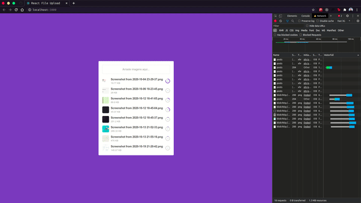

<h1 align="center">
  
</h1>

<h4 align="center">
  Upload Files React Node
</h4>
<p align="center">
  

  
  
  <a href="https://github.com/gagigante/upload-files-react-node/commits/master">
    
  </a>

  <a href="https://github.com/gagigante/upload-files-react-node/issues">
    
  </a>

  

<p align="center">  
  <a href="#rocket-technologies">Technologies</a>&nbsp;&nbsp;&nbsp;|&nbsp;&nbsp;&nbsp;  
  <a href="#computer-project">Project</a>&nbsp;&nbsp;&nbsp;|&nbsp;&nbsp;&nbsp;
  <a href="#runner-how-to-run">How to run</a>&nbsp;&nbsp;&nbsp;|&nbsp;&nbsp;&nbsp;
  <a href="#-how-to-contribute">How to contribute</a>&nbsp;&nbsp;&nbsp;|&nbsp;&nbsp;&nbsp;
  <a href="#memo-license">License</a>
</p>

<br>

<p align="center">
   
</p>

## :rocket: Technologies

This project was developed with the following techs:

- [Node](https://nodejs.org/en/)
- [React](https://reactjs.org/)
- [Mongo](https://www.mongodb.com/)
- [Multer](https://www.npmjs.com/package/multer)
- [Axios](https://github.com/axios/axios)
- [AWS S3](https://aws.amazon.com/pt/s3/)

## :computer: Project

Learning how to monitor files upload progress

## :runner: How to run

### Backend

#### API Reference: 
[](https://insomnia.rest/run/?label=upload-files-react-node&uri=https%3A%2F%2Fraw.githubusercontent.com%2Fgagigante%2Fupload-files-react-node%2Fmain%2F.github%2Fapi-reference.json)

Access `server` folder and install the dependencies
```
  $ yarn

  # or

  $ npm install
```

You will need a mongodb instance. If you have docker in your device you can create a docker mongo instance:
```
  docker run --name mongo -p 27017:27017 -d -t mongo
```

Create a file named `.env` based on `.env.example` in the root
```
  APP_URL=http://localhost:3333

  # s3: PARA PRODUÇÃO
  # local: PARA DESENVOLVIMENTO
  STORAGE_TYPE=local

  # CONEXÃO COM MONGO
  MONGO_URL=mongodb://localhost:27017/upload

  # AWS ENV PARA PRODUÇÃO
  BUCKET_NAME=
  AWS_ACCESS_KEY_ID=
  AWS_SECRET_ACCESS_KEY=
  AWS_DEFAULT_REGION=us-east-1
```

After all, you should be able to start the server:
```
  $ yarn dev

  # or

  $ npm run dev
```

### Frontend

Access `web` folder and install the dependencies
```
  $ yarn

  # or

  $ npm install
```

After that start the server
```
  $ yarn start

  # or

  $ npm run start
```

## 🤔 How to contribute

- Fork this repo;
- Create a branch for your new feature: `git checkout -b my-feature`;
- Commit your changes: `git commit -m 'feat: My brand new feature'`;
- Push it to your branch: `git push origin my-feature`.

After merge of your pull request, you can delete your branch.

## :memo: License

This project is under MIT license. See the file [LICENSE](LICENSE) for details.

---
